# Post-Quantum Secure IoT Key Exchange on ESP32

> Quantum-safe key establishment and secure messaging for constrained IoT/embedded devices, validated on real ESP32 hardware.

This repository contains all the artefacts of my undergraduate thesis in Computer Science on **post-quantum cryptography (PQC) for embedded systems**.  
The work focuses on:

- Benchmarking **ML-KEM (Kyber)** against classical key-exchange schemes (**RSA** and **ECDH**) on an **ESP32**.
- Designing a **quantum-safe communication architecture** for IoT devices.
- Implementing and validating this architecture in a **real IoT scenario**.
- Measuring **execution time**, **memory (stack/RAM)**, and **energy consumption** using an **INA226** power monitor.

---

## Table of Contents

- [Project Overview](#project-overview)
- [Repository Structure](#repository-structure)
- [Architecture and Design](#architecture-and-design)
  - [High-Level Architecture](#high-level-architecture)
  - [Key Exchange and Secure Channel](#key-exchange-and-secure-channel)
  - [NFC and UART Communication](#nfc-and-uart-communication)
- [Benchmarks and Measurements](#benchmarks-and-measurements)
  - [Algorithms Evaluated](#algorithms-evaluated)
  - [Metrics Collected](#metrics-collected)
  - [Measurement Setup](#measurement-setup)
- [Scripts and Result Visualization](#scripts-and-result-visualization)
- [Getting Started](#getting-started)
  - [Hardware Requirements](#hardware-requirements)
  - [Software Requirements](#software-requirements)
  - [Building and Flashing](#building-and-flashing)
- [How to Reproduce the Experiments](#how-to-reproduce-the-experiments)
- [Results Overview](#results-overview)
- [Folder-by-Folder Details](#folder-by-folder-details)
- [Future Work](#future-work)
- [License](#license)

---

## Project Overview

Modern IoT systems rely on **resource-constrained microcontrollers** that must still provide strong security guarantees for sensitive data (personal information, payment data, sensor readings, etc.). At the same time, **classical cryptography** (RSA, ECC) is threatened by the future advent of **quantum computers**, which can break these schemes in practical time.

This project:

- Evaluates **post-quantum key encapsulation** (ML-KEM / Kyber) on a **commercial ESP32**.
- Compares it with **classical ECDH and RSA** at **equivalent security levels** (≈128/192/256 bits).
- Proposes and implements a **quantum-safe message exchange architecture** for IoT devices, combining:
  - ML-KEM for key exchange;
  - **AES-CTR** for symmetric encryption;
  - **HMAC-SHA-256** for message authentication.
- Validates the proposal using a **real IoT setup** with:
  - NFC reader (**RC522**),
  - Two ESP32 boards communicating via **UART**,
  - **INA226** sensor for energy measurements.

The repository is organized so that **documentation**, **development code**, **benchmarks**, and **plotting scripts** are cleanly separated.

---

## Repository Structure

```text
.
├── 00_Documentation/          # TCC documents and images
│   └── Imagens/
│       ├── aesfluxo.png
│       ├── Arq-sec-1.pdf
│       ├── Arquitetura.jpg
│       ├── Arquitetura.pdf
│       ├── Diagrama-energia.jpg
│       ├── Diagrama-memória.jpg
│       ├── Diagrama-tempo.jpg
│       ├── energias.png
│       ├── Fluxograma-alg-arq.jpg
│       ├── INA226.jpg
│       ├── keyexchange.png
│       ├── nomes.txt
│       ├── rfid-circuito.jpg
│       ├── stack.png
│       └── tempos.png
├── 01_Referenciais/           # Reference papers and related work
├── 02_Development/            # Implementation of the proposed architecture
├── 03_Benchmark/              # Benchmark code for ML-KEM, RSA, ECDH
└── 04_Scripts/                # Scripts that generated the plots and tables
```

---

## Architecture and Design

### High-Level Architecture

The proposed **quantum-safe IoT architecture** connects:

- An **NFC-enabled node** (ESP32 + RC522),
- A **central node** (second ESP32),
- A **secure communication channel** over UART using PQC-based key exchange and symmetric cryptography.

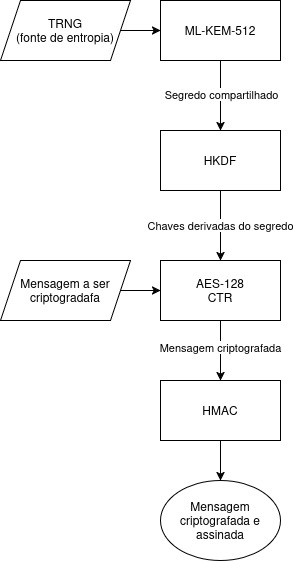  
_Vector version_: [Arquitetura.pdf](00_Documentation/Imagens/Arquitetura.pdf)

Additional security / architecture diagram:

- [Arq-sec-1.pdf](00_Documentation/Imagens/Arq-sec-1.pdf)

The architecture is designed to be:

- **Quantum-safe** at the key-exchange layer (ML-KEM).
- **Efficient** enough to run on ESP32-class microcontrollers.
- **Modular**, so that the key-exchange primitive can be swapped if new PQC standards appear.

### Key Exchange and Secure Channel

Key exchange is based on **ML-KEM (Kyber)**, following the NIST standardization process:

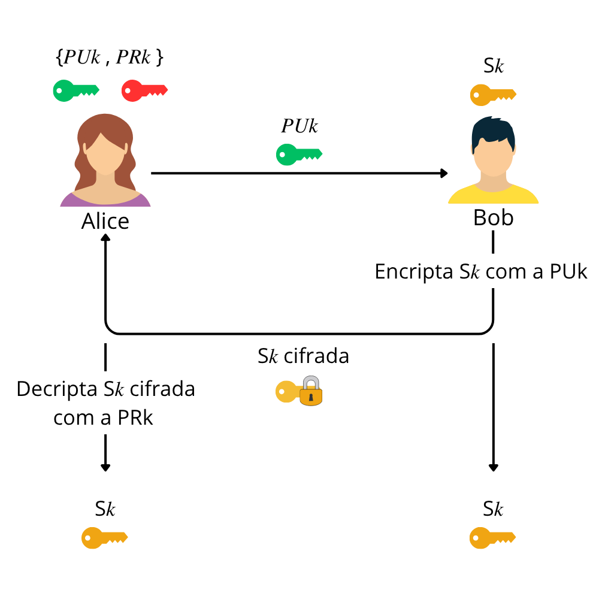

Once the shared secret is established, it is expanded into:

- An **AES-CTR 128-bit key** for confidentiality.
- An **HMAC-SHA-256 key** for integrity and authenticity.

The overall cryptographic data flow of the secure channel is illustrated in:

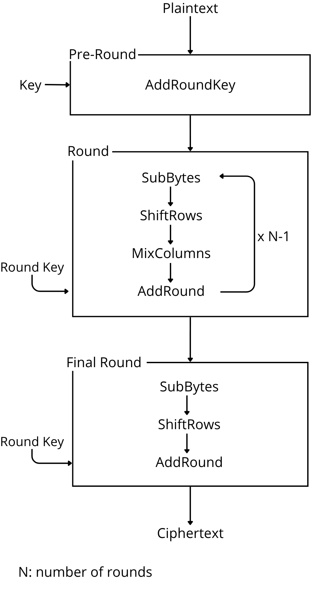

Key characteristics:

- **Post-quantum key establishment** (ML-KEM-512/768/1024).
- **Symmetric encryption** with AES-CTR (stream-like, no padding, well-suited to ESP32).
- **Message authentication** with HMAC-SHA-256.
- Custom **UART framing** including:
  - Magic header bytes,
  - Frame type (SYN/ACK/NACK/DATA),
  - Length fields,
  - Nonce/IV for AES-CTR,
  - Ciphertext and HMAC.

### NFC and UART Communication

The **NFC reader (RC522)** is used as a realistic, contactless data source for the architecture:

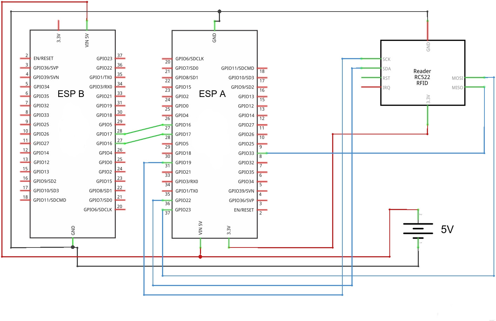

Data read from NFC is:

1. Acquired by ESP-A (NFC node).
2. Encrypted using the established session key.
3. Framed and sent via **UART** to ESP-B (central node).
4. Decrypted and authenticated on ESP-B.

The global control flow of the architecture and algorithms is summarized in:

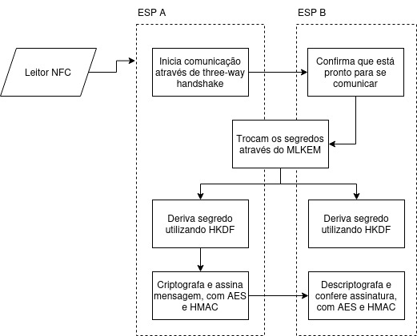

---

## Benchmarks and Measurements

### Algorithms Evaluated

The following key-exchange algorithms are evaluated on **ESP32**:

- **Post-Quantum (ML-KEM / Kyber)**
  - ML-KEM-512
  - ML-KEM-768
  - ML-KEM-1024

- **Classical Elliptic-Curve Diffie-Hellman (ECDH)**
  - P-256
  - P-384
  - P-521

- **Classical RSA (OAEP)**
  - RSA-3072
  - RSA-7680
  - RSA-15360 (subject to resource limits on ESP32)

### Metrics Collected

For each algorithm and security level, the benchmarks measure:

- **Execution time** (µs)
- **Stack usage** (bytes)
- **Heap/memory usage** (when applicable)
- **Energy consumption** (µJ / operation)

The following images summarize part of the results:

- Execution time profiles:
  - 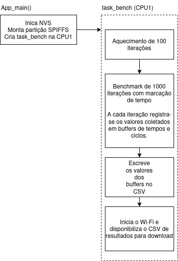
  - 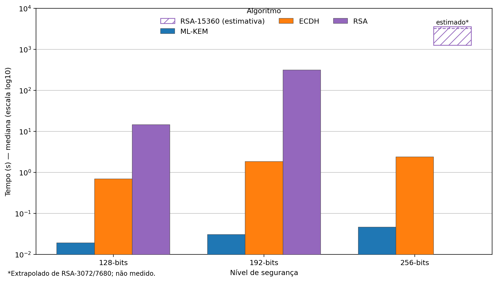

- Stack usage:
  - 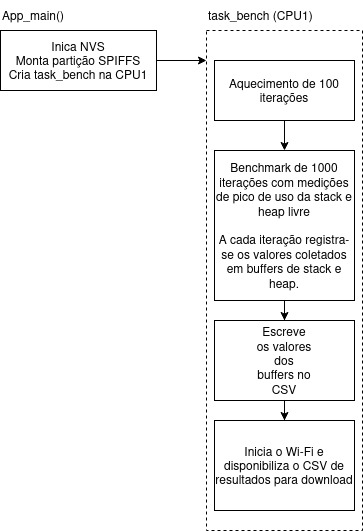
  - 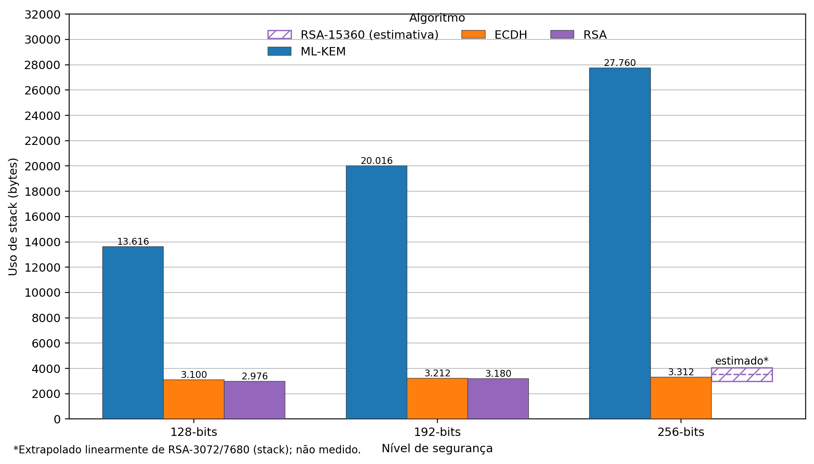

- Energy consumption:
  - 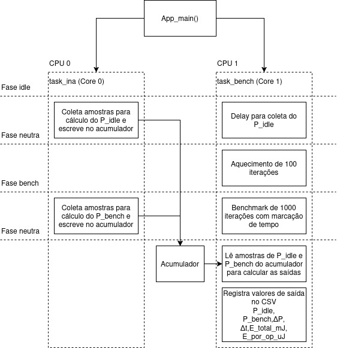
  - 

### Measurement Setup

Energy measurements are performed with an **INA226** current/voltage monitor in series with the ESP32 board:

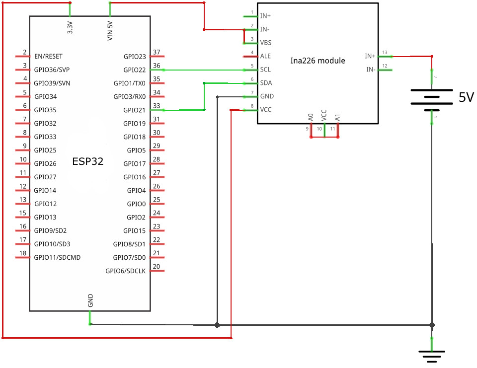

Key points:

- INA226 is connected via I²C to the ESP32.
- A known shunt resistor is used to compute current and power.
- The benchmark code configures the INA226, then:
  - Measures a **baseline** (idle consumption).
  - Executes the cryptographic operation in **epochs**.
  - Integrates the energy for each operation and logs it alongside time and stack usage.

---

## Scripts and Result Visualization

The folder **`04_Scripts/`** contains the scripts used to:

- Parse raw CSV/txt outputs produced by the ESP32 benchmarks.
- Compute descriptive statistics (mean, median, interquartile range, etc.).
- Generate the plots seen in:

  - `Diagrama-tempo.jpg`, `Diagrama-memória.jpg`, `Diagrama-energia.jpg`
  - `tempos.png`, `stack.png`, `energias.png`

Typical workflow:

1. Export benchmark results from ESP32 (via UART, HTTP, or SPIFFS file system).
2. Place CSV/txt files in the appropriate input folder for the script.
3. Run the corresponding script from `04_Scripts/`.
4. Collect the generated plots and tables for inclusion in the TCC.

---

## Getting Started

### Hardware Requirements

To fully reproduce the experiments, you will need:

- 2× **ESP32** development boards (e.g., ESP32-WROOM).
- 1× **MFRC522 (RC522)** RFID/NFC reader.
- 1× **INA226** current/voltage sensor + shunt resistor.
- Breadboard, jump wires, and USB cables.

### Software Requirements

- **ESP-IDF** (tested with 5.x).
- ESP32 toolchain (gcc, CMake, Ninja, etc.).
- Python 3.x for scripts in `04_Scripts/`.
- Standard Python plotting libraries (e.g., Matplotlib, NumPy, Pandas).
- ML-KEM (Kyber) implementation based on **PQClean**, integrated into the ESP-IDF projects.

### Building and Flashing

Inside each ESP-IDF project (e.g., under `02_Development/` or `03_Benchmark/`):

```bash
# Configure target
idf.py set-target esp32

# Configure project (menuconfig, Wi-Fi credentials, pins, etc.)
idf.py menuconfig

# Build
idf.py build

# Flash and monitor
idf.py flash monitor
```

Individual projects may document:

- Which algorithm and parameter set they benchmark (ML-KEM-512, ECDH-P256, RSA-3072, etc.).
- On which **CPU core** tasks are pinned.
- Stack sizes used for each FreeRTOS task.
- INA226 configuration (I²C address, shunt resistance, averaging mode, etc.).

---

## How to Reproduce the Experiments

A typical reproduction flow:

1. **Run Benchmarks (`03_Benchmark/`)**
   - Choose a benchmark (e.g., ML-KEM-512, RSA-3072, ECDH-P256).
   - Flash the ESP32 with the corresponding firmware.
   - Let the firmware:
     - Perform a warm-up phase.
     - Run a fixed number of iterations (e.g., 1000).
     - Log results to CSV with fields such as:
       - Iteration index
       - Key generation time
       - Encapsulation / decapsulation time
       - Stack watermark
       - Energy per operation

2. **Measure Energy**
   - Wire the **INA226** as shown in `INA226.jpg`.
   - Configure shunt calibration in the firmware.
   - Ensure the INA226 is powered and working via I²C.
   - Collect energy measurements along with the benchmark data.

3. **Validate the Architecture (`02_Development/`)**
   - Flash **ESP-A** (NFC node) and **ESP-B** (central node).
   - Connect them via UART as specified in the code.
   - Use the RC522 to read a message from an NFC card.
   - Verify that the message is:
     - Encrypted with AES-CTR.
     - Authenticated with HMAC-SHA-256.
     - Successfully decrypted and validated on ESP-B.

4. **Process Data (`04_Scripts/`)**
   - Copy the `.csv` or `.txt` outputs from the devices to your PC.
   - Run the scripts in `04_Scripts/` to:
     - Compute statistics per algorithm and security level.
     - Generate plots for:
       - Time vs. security level.
       - Stack vs. security level.
       - Energy vs. security level.
   - The resulting figures correspond to `tempos.png`, `stack.png`, `energias.png`, and the diagram images.

---

## Results Overview

At a high level, the results show:

- **ML-KEM** is computationally heavier than classical ECDH at the same security level, but remains feasible on ESP32 in terms of:
  - Execution time,
  - Stack usage (with careful task sizing),
  - Energy consumption.

- **RSA** (especially large key sizes like 7680 and 15360 bits):
  - Shows **very high time and energy costs**.
  - Approaches or exceeds practical limits on stack and/or heap in some configurations.

- For realistic IoT deployments on ESP32-class devices:

  - **ML-KEM-512**, combined with **AES-CTR + HMAC-SHA-256**, provides a **quantum-safe** and **practical** solution.
  - The proposed architecture demonstrates that **PQC-based key exchange** can be integrated into a **real IoT scenario** using off-the-shelf hardware.

These conclusions are visualized in the time, stack, and energy diagrams:

- `Diagrama-tempo.jpg`, `Diagrama-memória.jpg`, `Diagrama-energia.jpg`
- `tempos.png`, `stack.png`, `energias.png`

---

## Folder-by-Folder Details

### `00_Documentation/`

Contains TCC-related documentation and images:

- **Architecture & Security**
  - `Arquitetura.jpg`, `Arquitetura.pdf`
  - `Arq-sec-1.pdf`
  - `Fluxograma-alg-arq.jpg`
  - `aesfluxo.png`
  - `keyexchange.png`

- **Measurements & Results**
  - `Diagrama-tempo.jpg`, `Diagrama-memória.jpg`, `Diagrama-energia.jpg`
  - `tempos.png`, `stack.png`, `energias.png`

- **Hardware**
  - `INA226.jpg`
  - `rfid-circuito.jpg`

- **Misc**
  - `nomes.txt` (auxiliary text file, e.g., legends, labels or naming).

### `01_Referenciais/`

Collection of **scientific papers and references** used in the thesis, including:

- NIST PQC documentation.
- Kyber / ML-KEM papers.
- Works evaluating post-quantum cryptography on embedded systems.
- Related work comparing time, memory, and energy in constrained devices.

### `02_Development/`

Implementation of the **proposed quantum-safe architecture**, including (but not limited to):

- NFC reading (RC522 driver and helpers).
- ML-KEM key pair generation and encapsulation/decapsulation.
- Key derivation (e.g., HKDF) for AES and HMAC keys.
- AES-CTR encryption/decryption routines.
- HMAC-SHA-256 for message authentication.
- UART framing, handshake (SYN/ACK/NACK), and error handling.
- FreeRTOS tasks pinned to specific cores, with tuned stack sizes.

### `03_Benchmark/`

Standalone benchmark programs for:

- **ML-KEM** (512, 768, 1024).
- **ECDH** (P-256, P-384, P-521).
- **RSA-OAEP** (3072, 7680, 15360, where feasible).

Each benchmark typically:

- Fixes CPU frequency and power management.
- Measures time with:
  - High-resolution timers, and/or
  - CPU cycle counters.
- Measures memory (stack/heap) usage.
- Uses INA226 to obtain energy per operation.
- Logs results in CSV or similar formats for later analysis.

### `04_Scripts/`

Data processing and plotting scripts that:

- Read benchmark outputs.
- Compute statistics (e.g., mean, median, IQR).
- Generate publication-ready figures and tables for the thesis.

---

## Future Work

Possible extensions of this repository include:

- Evaluating **other post-quantum KEMs and signature schemes** (e.g., Dilithium, Saber, etc.).
- Porting the architecture to **other microcontroller families** (ARM Cortex-M, RISC-V).
- Exploring **hardware acceleration** for AES and hashing on platforms that support it.
- Integrating **secure boot** and **firmware update** workflows with post-quantum primitives.
- Extending the architecture to **multi-hop IoT networks** and gateway devices.

